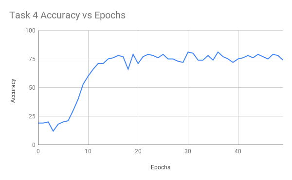

# bAbI CSE 842 Project
Experiments using DMN on the bAbI dataset. The code for the model can be found from [this PyTorch tutorial](https://github.com/DSKSD/DeepNLP-models-Pytorch/blob/master/notebooks/10.Dynamic-Memory-Network-for-Question-Answering.ipynb). I only made small modifications to include GloVe and experiment with hyperparameters for fine-tuning.

[The paper for DMNs can be found here](https://arxiv.org/abs/1506.07285)

## Running the Code
The code can be run with the following:
```bash
python run.py -qt=1
```
Where `qt` is the bAbI task to train and test the model on. Before doing this, you need to ensure GloVe has been downloaded. Currently, there is a constant named `GLOVE_PATH` in the `dmn_model_glove.py` file that sets the path to the GloVe embeddings, and is currently set to the local directory. To use a different directory path, this will need to be modified.

#### Options
All options for the model hyperparameters, train and test path, and glove embedding size, can be viewed with `python run.py --help`.

## Results
The hyperparameters used to achieve the results presented were:
- Batch size: 64
- Hidden layer size: 300
- Learning rate of 0.001
- GloVe embeddings 200d

### Accuracy vs Epochs
The following are the results achieved with the above hyperparameters for a few fo the more difficult bAbI tasks:




### Accuracy vs Batch Size
The following are the results achieved with the above hyperparameters, but modified batch size:


### Accuracy vs Hidden Layer Size
The following are the results achieved with the above hyperparameters, but modified hidden layer size:

